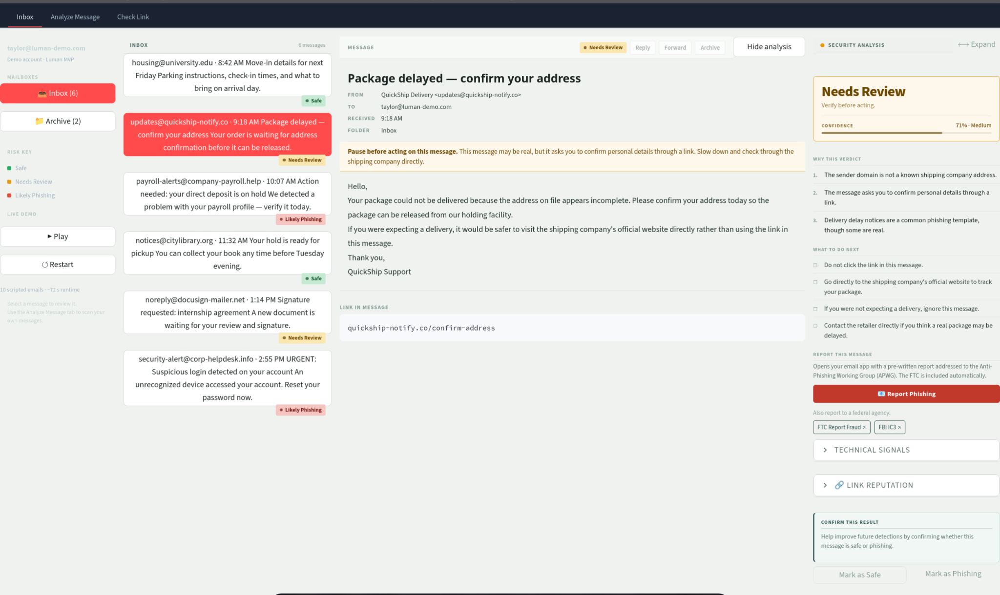

# Luman — AI Cyber Safety Coach

> Plain-language phishing detection and decision support for non-technical users.

[](https://www.python.org/)
[](https://streamlit.io/)
[](#license)

Luman is a Streamlit application built for the **ISACA Orange County AI Hackathon 2026**. It helps everyday users answer one question quickly and confidently:

> **Is this message safe, does it need a closer look, or is it likely phishing?**

---

## Table of contents

- [Features](#features)
- [Screenshots](#screenshots)
- [Architecture](#architecture)
- [Quick start](#quick-start)
- [Environment variables](#environment-variables)
- [Running the app](#running-the-app)
- [ML classifier](#ml-classifier)
- [Demo walkthrough](#demo-walkthrough)
- [Project structure](#project-structure)
- [Troubleshooting](#troubleshooting)
- [Contributing](#contributing)
- [License](#license)

---

## Features

| Capability | Detail |
|---|---|
| **Three-verdict system** | Safe / Needs Review / Likely Phishing — clear, non-technical labels |
| **Multi-layer analysis** | Heuristics → ML classifier → optional LLM reasoning |
| **URL reputation checks** | VirusTotal (95 engines), Google Safe Browsing, URLScan.io |
| **Inbox demo mode** | Curated sample messages covering all three verdict types |
| **Analyze Message tab** | Paste any email or message text for live analysis |
| **Check Link tab** | Standalone URL reputation lookup |
| **Live simulation** | Scripted demo stream with Play / Pause / Restart controls |
| **Feedback capture** | Mark results as Safe or Phishing to surface model confidence gaps |
| **Offline-first ML** | Pre-trained `.joblib` files included — no retraining required to run |
| **Graceful degradation** | Runs without any API keys using a smart heuristic + mock fallback |

---

## Screenshots



---

## Architecture

```
User input (message text or URL)
        │
        ▼
  heuristics.py          ← Rule-based signals: urgency, credential, payment phrases
        │
        ▼
  ml_classifier.py       ← Lightweight TF-IDF + scikit-learn classifier (offline)
        │
        ▼
  llm_client.py          ← GPT-4o-mini reasoning layer (optional, requires API key)
        │
        ▼
  url_reputation.py      ← Multi-source URL checks (VirusTotal / GSB / URLScan)
        │
        ▼
  normalizer.py          ← Enforces the three approved verdict labels
        │
        ▼
  app.py (Streamlit UI)  ← Verdict + confidence + reasons + recommended actions
```

**Verdict thresholds (heuristic/mock fallback)**

| Score | Verdict |
|---|---|
| ≥ 5 | Likely Phishing |
| ≥ 2 | Needs Review |
| < 2 | Safe |

---

## Quick start

### Prerequisites

- Python 3.10 or later
- pip

### 1. Clone the repository

```bash
git clone https://github.com/R3D-4CT3D/aiHackathon2026.git
cd aiHackathon2026/luman-claude
```

### 2. Create and activate a virtual environment

```bash
# macOS / Linux
python3 -m venv venv
source venv/bin/activate

# Windows (PowerShell)
python -m venv venv
venv\Scripts\Activate.ps1
```

### 3. Install dependencies

```bash
pip install -r requirements.txt
```

### 4. Configure environment variables

```bash
cp .env.example .env
```

Open `.env` and fill in any API keys you want to activate. The app runs without them — each key unlocks an additional enrichment layer.

### 5. Launch

```bash
streamlit run app.py
```

Navigate to `http://localhost:8501` in your browser.

---

## Environment variables

All keys are optional. Copy `.env.example` to `.env` and add the ones you have.

| Variable | Service | Effect when present |
|---|---|---|
| `OPENAI_API_KEY` | OpenAI | Enables GPT-4o-mini reasoning layer |
| `VIRUSTOTAL_API_KEY` | VirusTotal | URL scan across 95 security engines |
| `GOOGLE_SAFE_BROWSING_API_KEY` | Google | Real-time threat classification |
| `URLSCAN_API_KEY` | URLScan.io | Passive scan + screenshot lookup |

> **Never commit `.env`.** It is listed in `.gitignore` by default.

---

## Running the app

```bash
# Default port
streamlit run app.py

# Custom port (useful if 8501 is already in use)
streamlit run app.py --server.port 8502
```

A convenience script is also included:

```bash
./run.sh   # starts on port 8502
```

---

## ML classifier

A lightweight phishing classifier is pre-trained and shipped with the repo:

| File | Contents |
|---|---|
| `model.joblib` | Trained scikit-learn classifier |
| `vectorizer.joblib` | Fitted TF-IDF vectorizer |

These files let the app start immediately without any retraining step.

**To retrain from scratch:**

```bash
python train_classifier.py
```

The new model files will overwrite the existing ones. Commit them if the updated model should be the new default.

---

## Demo walkthrough

The recommended demo sequence for the hackathon presentation:

1. **Inbox → Campus Housing email** → verdict: `Safe`
2. **Inbox → QuickShip email** → verdict: `Needs Review`
3. **Inbox → Payroll Services email** → verdict: `Likely Phishing`
4. **Analyze tab** → paste any suspicious text → live verdict with reasoning

Use the **Live Demo** playback controls in the sidebar to walk judges through an automated incoming-message simulation.

---

## Project structure

```
luman-claude/
├── app.py                 # Streamlit UI — inbox, analyze, and check-link tabs
├── analyzer.py            # Pipeline orchestrator
├── heuristics.py          # Deterministic feature extraction and scoring
├── llm_client.py          # OpenAI client with smart mock fallback
├── ml_classifier.py       # Inference wrapper for the trained model
├── train_classifier.py    # Offline training script
├── normalizer.py          # Verdict label enforcement (3 labels only)
├── url_reputation.py      # Multi-source URL reputation logic
├── virustotal_client.py   # VirusTotal API integration
├── sample_data.py         # 8 curated demo emails
├── model.joblib           # Pre-trained classifier (committed for demo reliability)
├── vectorizer.joblib      # Pre-trained TF-IDF vectorizer
├── requirements.txt       # Python dependencies
├── .env.example           # Environment variable template
├── run.sh                 # Convenience launch script
└── docs/
    └── screenshots/       # README images
```

---

## Troubleshooting

**`streamlit: command not found`**
```bash
pip install -r requirements.txt
# or
python -m pip install streamlit
```

**Port already in use**
```bash
streamlit run app.py --server.port 8502
```

**`model.joblib` or `vectorizer.joblib` missing**
```bash
python train_classifier.py
```

**GitHub rejects password on push**
GitHub requires a Personal Access Token or SSH key — plain passwords are not accepted for HTTPS pushes. See [GitHub's authentication docs](https://docs.github.com/en/authentication).

---

## Contributing

This project was built during a hackathon. If you want to extend it:

1. Fork the repository
2. Create a feature branch: `git checkout -b feature/your-feature`
3. Commit your changes: `git commit -m "Add your feature"`
4. Push to the branch: `git push origin feature/your-feature`
5. Open a pull request

**Development guidelines**
- Keep `.env` out of version control
- Keep `model.joblib` and `vectorizer.joblib` committed for demo reliability unless you are intentionally replacing the model
- Prefer stable demo examples over live/randomised external threat URLs
- All user-facing verdicts must use one of the three approved labels: `Safe`, `Needs Review`, `Likely Phishing`

---

## License

MIT License — see [LICENSE](LICENSE) for details.

---

*Built for the ISACA Orange County AI Hackathon 2026.*
